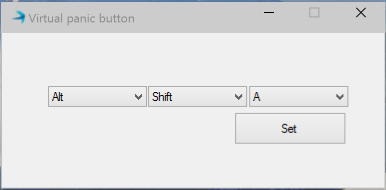

ReachPlus Alerts Hot key
---------------
This code sample lets user to select the hot key to send alerts in quick manner using ReachPlus Alerts SDK. When this application is minimized, its icon stays in the system tray.


You may need to update the configurations parameters like user name,  password and others in *ServerMonitor.exe.config*. 

**url** : This is URL of ReachPlus Server SDK

**user**: Username of ReachPlus Server SDK

**password**: Password of ReachPlus Server SDK user

**alertfile**: File name of the alert payload

**serveraddress**: Address of the server to which we want to monitor


```xml
    <?xml version="1.0" encoding="utf-8" ?>
    <configuration>
      <appSettings>
        <add key="url" value="http://192.168.5.168:8080/rpas-webservices/jobs"/>
        <add key="user" value="admin"/>
        <add key="password" value="alerts"/>
        <add key="alertfile" value="samplealert.xml"/>
        <add key="serveraddress" value="192.168.5.183"/>
      </appSettings>
    </configuration>
```


