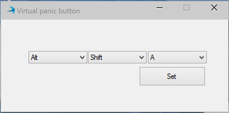

ReachPlus Alerts Hot key
---------------
This code sample allows users to select hot keys to send alerts quickly using the ReachPlus Alerts SDK. When this application is minimized, its icon will still be displayed in the system tray. ReachPlus Alerts server 5.6.0(releasing soon) is required for this samle to work.


You may need to update the configuration parameters such as the username and password in *ServerMonitor.exe.config*. 

**url** : This is URL of ReachPlus Server SDK

**user**: Username of ReachPlus Server SDK user

**password**: Password of ReachPlus Server SDK user

**alertfile**: File name of the alert payload

**serveraddress**: Address of the server which we want to monitor


```xml
    <?xml version="1.0" encoding="utf-8" ?>
    <configuration>
      <appSettings>
        <add key="url" value="http://192.168.5.166:47665/jobs"/>
        <add key="user" value="admin"/>
        <add key="password" value="alerts"/>
        <add key="alertfile" value="samplealert.xml"/>
        <add key="serveraddress" value="192.168.5.166"/>
      </appSettings>
    </configuration>
```


